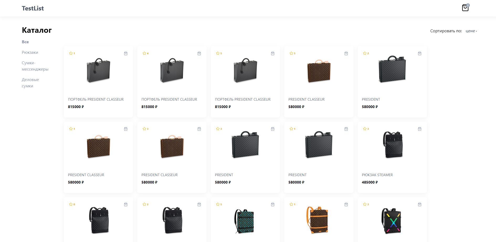
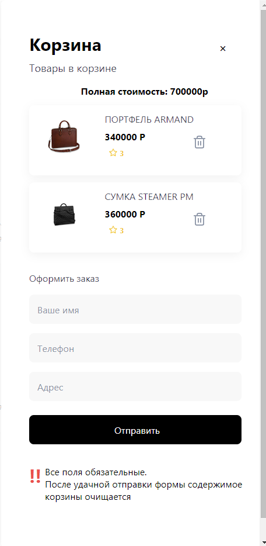

# Интернет-магазин брендовых сумок

## Дэплой
______

https://vercel.com/weston712/shop-branded-backpacks/FQbiygd9QvEF8fdZoAZHyHNz8tEQ

___

## Функционал
___________

+ Товары можно добавлять в корзину
+ Товары можно удалить из корзины
+ Фильтрация товара по категориям
+ Фильтрация товара по цене
+ Фильтрация товара по рейтингу
+ Фильтрация товара по категории

# Стек
+ Vue 3 Composition API
+ Tailwindcss
+ Pinia
+ API товаров https://frontend-test.idaproject.com/api/product
+ API категории товаров https://frontend-test.idaproject.com/api/product-category

# Установка

1. Для запуска на локальной машине необходимо:

    Установить npm зависимости:

        npm install

2. Запустить в режиме разработки:
   
        npm run serve

   Если все прошло успешно, проект будет запущен на http://localhost:8080
